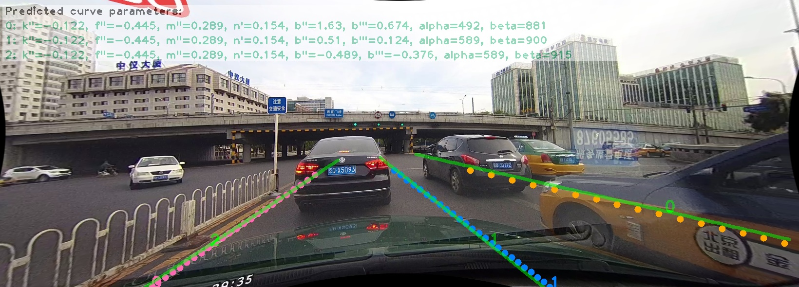
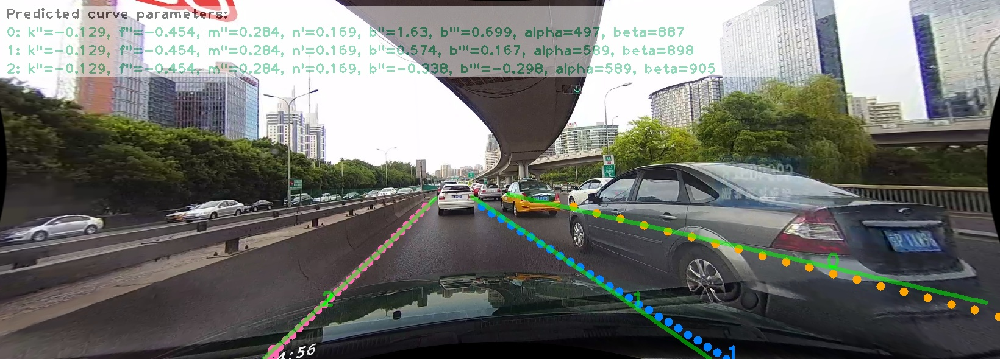

**LSTR**: Lane Shape Prediction with Transformers
=======


* 😎End-to-end architecture: Directly output lane shape parameters.
* ⚡Super lightweight: The number of model parameters is only 765,787.
* ⚡Super low complexity: The number of MACs (1 MAC = 2 FLOP) is only 574.280M.
* 😎Training friendly: Lower GPU memory cost. Input (360, 640, 3) with batch_size 16 uses 1245MiB GPU usages.

PyTorch(1.5.0) training, evaluating and pretrained models for LSTR (Lane Shape Prediction with Transformers).
We streamline the lane detection to a single-stage framework by proposing a novel lane shape model that achieves 96.18
TuSimple accuracy.

For details see [End-to-end Lane Shape Prediction with Transformers](https://arxiv.org/pdf/2011.04233.pdf)
by Ruijin Liu, Zejian Yuan, Tie Liu, Zhiliang Xiong.


## LSTR for CULane

***Please read carefully!***

This branch mainly provides training, evaluating and pretrained models of LSTR for CULane dataset.
 
* The implement is a vanilla version, and almost all of the hyper-parameters are not fine-tuned.
The uploaded model file was trained a few days ago, which achieves 0.64 CULane Fmeasure.

* Our paper does not focus on the CULane dataset, and my point in providing the code and model file 
is primarily to give you a template to play with other datasets.

* I may be interesting in tweaking the code to upload code and models that would get better 
performance, but that's not my top priority right now, so please do not be pushy and ask questions
about how to improve the performance on CULane dataset.

## Model Zoo

We provide the baseline LSTR_CULANE model file (trained on CULane train and val sets after 500000 iterations) in
the ./cache/nnet/LSTR_CULANE/LSTR_CULANE_500000.pkl (~3.1MB).

## Data Preparation

Download and extract CULane train, val and test with annotations from
[CULane](https://xingangpan.github.io/projects/CULane.html).

We expect the directory structure to be the following:
```
CULane/
    driver_23_30frame/
    driver_37_30frame/
    driver_100_30frame/
    driver_161_90frame/
    driver_182_30frame/
    driver_193_90frame/
    list/
        test_split/
        test.txt
        test_img.txt
        train.txt
        train_gt.txt
        val.txt
        val_gt.txt
TuSimple/
    LaneDetection/
        clips/
        label_data_0313.json
        label_data_0531.json
        label_data_0601.json
        test_label.json
    LSTR/
```

## Set Envirionment

* Linux ubuntu 16.04


```
conda env create --name lstr --file environment.txt
```

After you create the environment, activate it

```
conda activate lstr
```

Then

```
pip install -r requirements.txt
```

## Training and Evaluation

To train a model:

(if you only want to use the train set, please see ./config/LSTR_CULANE.json and
set "train_split": "train")
```
python train.py LSTR_CULANE
```
* Visualized images are in ./results during training.
* Saved model files (every 5000 iterations) are in ./cache during training.

To train a model from a snapshot model file:
```
python train.py LSTR_CULANE --iter 500000
```

To evaluate (GPU 603MiB usage when evaluating single image iteratively):
```
python test.py LSTR_CULANE --testiter 500000 --modality eval --split testing
```
then 
```
cd lane_evaluation
```
If you want to obtain the overall F1-measure:
```
bash run.sh
```
If you want to valid the splitting performance:
```
bash Run.sh
```
Please refer to [CULane](https://xingangpan.github.io/projects/CULane.html) to compile the evaluating environment.


To evaluate and save detected images in ./results/LSTR_CULANE/500000/testing/lane_debug:
```
python test.py LSTR_CULANE --testiter 500000 --modality eval --split testing --debug
```

* Demo (displayed parameters are rounded to three significant figures.)







To evaluate and save decoder attention maps (store --debugEnc to visualize encoder attention maps):
```
python test.py LSTR_CULANE --testiter 500000 --modality eval --split testing --debug --debugDec
```

To evaluate on a set of images (store your images in ./images, then the detected results will be saved in ./detections):
```
python test.py LSTR_CULANE --testiter 500000 --modality images --image_root ./ --debug
```

## Citation
```
@InProceedings{LSTR,
author = {Ruijin Liu and Zejian Yuan and Tie Liu and Zhiliang Xiong},
title = {End-to-end Lane Shape Prediction with Transformers},
booktitle = {WACV},
year = {2021}
}
```

## License
LSTR is released under BSD 3-Clause License. Please see [LICENSE](LICENSE) file for more information.

## Contributing
We actively welcome your pull requests!

## Acknowledgements

[DETR](https://github.com/facebookresearch/detr)

[PolyLaneNet](https://github.com/lucastabelini/PolyLaneNet)

[CornerNet](https://github.com/princeton-vl/CornerNet)

[CULane](https://xingangpan.github.io/projects/CULane.html)
